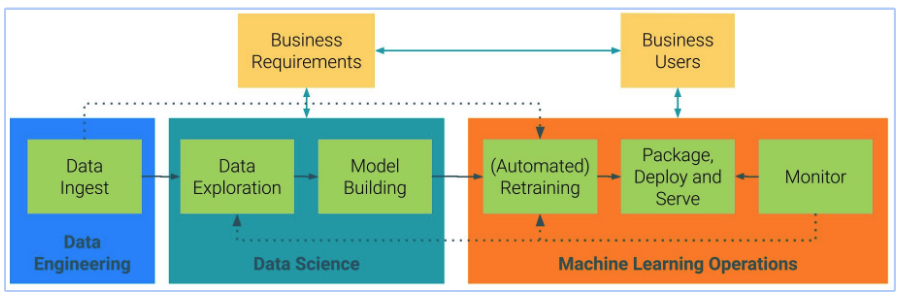

# CML Primer

## Introduction

Cloudera Machine Learning (CML) makes it easy to bring Data Scientists to the data platform and makes it easier to overcome the challenges they face on a day to day basis. Since industry standards are still evolving, there are new solutions required to fit new use cases. This repository is an effort to document solutions to common problems faced during implementation and utilisation of CML. By doing so, anyone with access to this repository can find solutions faster than they would do otherwise.

<b>Note:</b> This is not an exhaustive document. There can be scenarios that may not be covered here. In such cases, reach out the ML SME group. Please refer to Cloudera documentation on product related information.

## ML Lifecycle

ML lifecycle, in high level, provides a basis of any ML project. Stages in ML Lifecycle can be categorised into 4 stages in general:
* Data Engineering
* Data Science
* Machine Learning Operations (MLOps)
* Consumption (Business Users)

Each stage involve different sets of users. In Phase 1, Data Science stage is focused as it forms the core of ML lifecycle.

## CML Projects

CML Projects are the starting point in ML lifecycle.

As per Cloudera documentation, `"Projects form the heart of Cloudera Machine Learning. They hold all the code, configuration, and libraries needed to reproducibly run analyses. Each project is independent, ensuring users can work freely without interfering with one another or breaking existing workloads."`

Users can create a blank project, use existing templates or source from git repository.

### Create CML Project from git source

1. Setup SSH for remote Github by following the steps from [here](https://docs.cloudera.com/machine-learning/cloud/security/topics/ml-adding-ssh-key-to-github.html).
2. Create a CML project. Follow steps from [documentation](https://docs.cloudera.com/machine-learning/cloud/projects/topics/ml-creating-a-project-with-runtimes-c.html).

<b>Optional:</b> You can also create a blank project and pull data from existing git repository.

#### Update existing blank project from git source

1. After creating blank project, start a session and navigate to 'Terminal Access' 
2. Initialise git 
`git init` 
3. Add remote origin to your git repo 
`git remote add origin <REPO_URL>` 
4. Pull git repo from remote 
`git pull` 
5. Switch to existing branch 
`git switch <BRANCH_NAME>` 
6. \[Optional\] Create new branch 
`git checkout -b <BRANCH_NAME>` 

## ML Runtimes

`ML Runtimes are responsible for running data science workloads and intermediating access to the underlying cluster.`

ML runtimes are Docker images built on top a base image. There are number of out-of-box runtimes built and supported by Cloudera. Depending on the runtime, the base images vary. Users can create custom runtimes and use them in their projects. ML runtimes are open sourced in [this repository ](https://github.com/cloudera/ml-runtimes). These can be used to understand how to build a custom runtime from scratch.

## Kernels

Typically, each runtime have one of the programming language kernel - Python, R & Scala. Depending on the use case and project requirements, users can choose appropriate runtime with required kernel.

### Editors

As with kernels, runtimes with single editor like Workbench, Jupyterlab etc.

### GPU Support

ML runtimes also support GPUs.

## CML Sessions

CML session is where users run their code and applications.

Each session in a project can run using any available runtime including custom runtimes. Administrators can manage the available runtimes for projects. This allows for an organisation to bake-in enterprise standards in runtimes that are used in projects.

After creating a project, users create a new session and choose the required runtime. Refer [documentation](https://docs.cloudera.com/machine-learning/cloud/projects/topics/ml-launch-a-session.html) on how to create a session.

## Get Started

Now that basics are covered, let's get into how to use this repository.

This repository has been divided based on ML lifecycle stages. Each stage will have a set of modules depending on the phases involved in each stage. Within each module, how-to snippets have been included while walking through the lifecycle stage. Each customer and each project is unqiue. There can be a number of combinations of scenarios involved. Not all solutions are documented here. Obvious ones that are available elsewhere like Cloudera documentation are referrred where required. For the rest, please feel free to contribute if they are not already documented here.

We start with Data Science stage as that is where most projects start. Data scientists determine the data sources and spend time understanding their influence in the problem. Data engineers get involved when data scientists require assistance in sourcing some datasets that they cannot do it themselves on when project is mature enough to start productionising the data pipelines.

## Data Science stage

Data exploration, Feature Engineering, Baseline model, Model Training & Model evaluation form the key phases of Data Science stage. Data Scientists often spend time defining the problem and analysing the data before starting model building.

Follow the below documents to go through each phase:

[0. Setup](../notebooks/0_Setup.ipynb) 
[1. Baseline Model](../notebooks/1_Baseline_Model.ipynb) 
[2. Custom ML Runtime](../notebooks/2_Custom_ML_Runtime.ipynb) 
[3. Model Metrics](../notebooks/3_Model_Metrics.ipynb)
